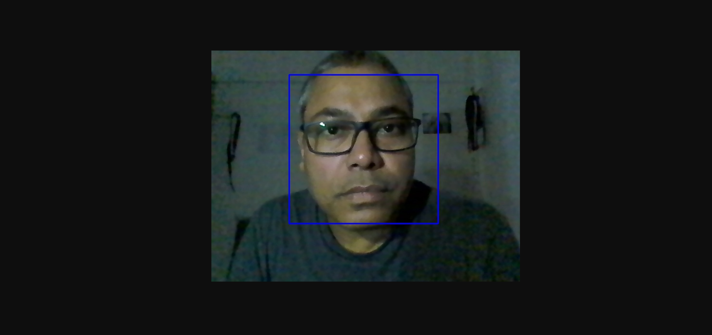
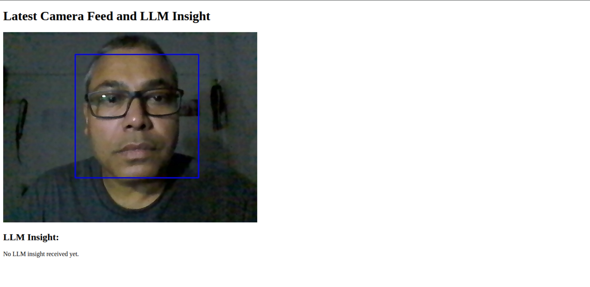

# 🧠 Edge AI Microservices with LLaMA 3.2 1B (Quantized) using `llama.cpp`

This project demonstrates a lightweight yet scalable **Edge AI microservice architecture**, where:





* A **camera detection service** performs real-time object detection.
* An **LLM service** (powered by a quantized LLaMA 3.2 1B model via [`llama.cpp`](https://github.com/ggerganov/llama.cpp)) generates intelligent responses.
* Communication happens over **MQTT** using a broker (e.g., Mosquitto).

You can **swap models** and **scale components independently** across devices (e.g., Raspberry Pi, edge boxes, laptops), thanks to its fully containerized microservice design.

---

## 🚀 Features

* ⚙️ Distributed microservices architecture
* 📦 Docker + Docker Compose deployment
* 🧠 Lightweight quantized LLM (customizable)
* 📡 MQTT-based communication between services
* 📷 Edge device compatibility (e.g., Raspberry Pi, microcontrollers)

---

## 📦 Services

| Service          | Description                                    |
| ---------------- | ---------------------------------------------- |
| `llm_service`    | LLaMA 3.2 1B Quantized model via llama.cpp     |
| `camera_service` | Real-time object detection (OpenCV/TensorFlow) |
| `mqtt_broker`    | Mosquitto MQTT Broker                          |
| `api_gateway`    | REST/HTTP gateway (optional UI integration)    |

---

## 💻 System 1: Laptop (Intel i5 / 32GB RAM)

### ✅ Prerequisites

* Python 3.10+
* Docker & Docker Compose
* MQTT broker (Mosquitto)
* Quantized `.gguf` model (e.g., `Llama-3.2-1B-Instruct-Q4_0` from TheBloke)

### 📁 Folder Structure

```
llm_service/
├── app.py
├── Dockerfile
├── requirements.txt
└── models/
    └── llama-3.2-1b-q4_0.gguf
```

### ▶️ Run with Docker Compose

```bash
docker-compose -f docker-compose.laptop.yml up --build --remove-orphans
```

> This builds all services and removes unused containers.

---

## 🍓 System 2: Raspberry Pi 4 (4GB/8GB)

### ✅ Prerequisites

* Raspberry Pi OS 64-bit
* Docker & Docker Compose
* Optional: Mosquitto for local MQTT

### ⚙️ Build for ARM64

```bash
docker buildx build --platform linux/arm64 -t llm_service ./llm_service
```

### ▶️ Run

```bash
docker run -v $(pwd)/models:/app/models --network host llm_service
```

> Use `--network host` if Mosquitto runs locally on the Pi.

---

## 🔗 MQTT Topics

| Topic          | Purpose                         |
| -------------- | ------------------------------- |
| `detections`   | Input: object detection events  |
| `llm_response` | Output: LLM-generated responses |

---

## 📥 Download Models

Download `.gguf` quantized models from:

* [TheBloke on Hugging Face](https://huggingface.co/TheBloke)
* Suggested: `bartowski/Llama-3.2-1B-Instruct-GGUF`

Place them in: `llm_service/models/`.

---

## ⚠️ System Tips

* Run: `ls /dev/video*` to identify camera device
* Add user permission: `sudo usermod -aG video $USER`
* Use swap on Raspberry Pi to manage memory
* Tune `n_threads` and context size for optimal performance

---

## 🔜 Coming Soon

* `camera_service/`: Real-time detection via OpenVINO/TensorFlow
* UI Dashboard (for interactions)
* Metrics & Logging

---

## 🤝 Contributions

We welcome contributions:

1. Fork & branch: `feature/your-feature-name`
2. Follow structure & style
3. Test before pushing
4. Submit a PR with description

For major changes, raise an issue first.

---
